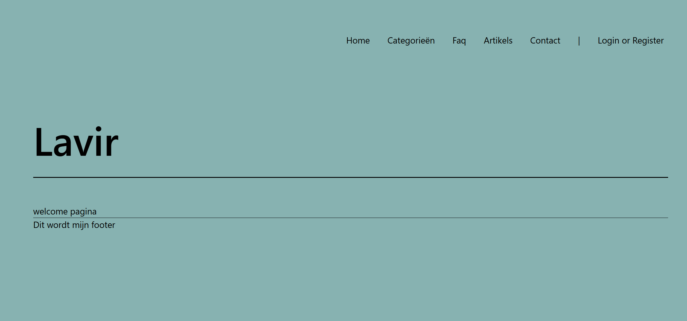

# Projectbeschrijving en functionaliteiten
Hier een korte omschrijving toevoegen

# Implementatie van elke technisch vereiste 
Bv waar in de code?/lijnnummer

# Installatiehandleiding
1. Clone de repository
```
mkdir lavir
cd lavir
git clone https://github.com/ndeblauw/lavirbe.git .
```
2. Installeer de benodigde dependencies
```
composer install
```
3. Maak een .env bestand aan en configureer de database verbinding
```
cp .env.example .env
```

4. Genereer een app key
```
php artisan key:generate
```
5. Voer de database migraties uit
```
php artisan migrate:fresh --seed
```

# Screenshots
Welcome page


# Gebruik
Er is een **admin user** geseed met de volgende credentials:
- Username: admin
- Email: admin@ehb.be
- Password: Password!321

Er is een gewone user geseed met de volgende credentials:
